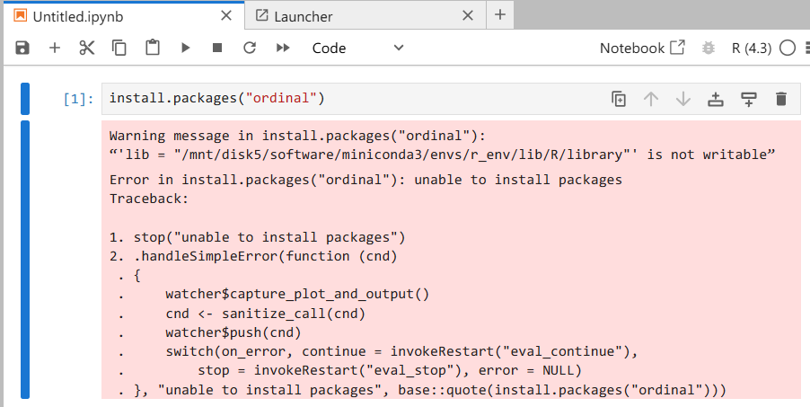

# A Brief Guide on Use R in JupyterLab

Till now, we only provide R in Jupyter. This is a short guide introducing how to run your R scripts on JupyterLab.

## Run R in JupyterLab

We have configurated R environment on our server using conda (`r_env`). Activate it by `conda activate r_env` and input `R` in terminal to get started with R, or click the R (4.3) button on the launcher page to initiate a notebook.

### **1. Two Ways to Use R in JupyterLab**

#### **Option 1: Jupyter Notebook with R Kernel**

- Launch a new R notebook: Click the button named `R` under "Notebook"
- Write R code in cells and run them with `Shift + Enter`.

#### **Option 2: Terminal (Command Line)**

- Open a terminal in JupyterLab:
  - **Interactive R**: Run `R` to launch an R REPL.
  - **Run R scripts**: Use `Rscript path/to/your_script.R` to execute scripts.

------

### **2. Check/Set Working Directory**

```R
# Check current working directory
getwd()

# Set working directory (use absolute paths)
setwd("/path/to/your/directory")
```

------

### **3. Install Libraries**

Installing packages directly from a Jupyter notebook using `install.packages()` may result in errors such as:


To install packages not available in the shared library pool, use the terminal. R will prompt you to create a personal user library folder if one doesn't already exist. Make sure to activate the correct environment before proceeding.

```shell
# One-liner installation
$ R -e 'install.packages("dplyr")'

# Or, enter R programming first and then input the command `install.packages`
$ R
> install.packages(c('repr', 'IRdisplay', 'evaluate', 'crayon', 'pbdZMQ', 'devtools', 'uuid', 'digest'))
```

------

### **4. View Variables**

**In Notebook:**

- Use `ls()` to list variables.
- Use `print(variable_name)` or type the variable name directly.
- For detailed views: `ls.str()` (structure of variables).

**In Terminal (Interactive R):**
Same commands as above (`ls()`, `print()`, etc.).

------

### **5. View and Save Graphs**

**In Notebook:**

- Plots auto-display inline after `plot()`, `ggplot()`, etc.

- Save plots programmatically:

  ```R
  library(ggplot2)
  p <- ggplot(...) + ...  # Create plot
  ggsave("plot.png", p)   # Save to file
  ```

**In Terminal:**

- Save plots to files explicitly:

  ```R
  pdf("plot.pdf")
  plot(x, y)
  dev.off()
  ```

------

### **6. Import Functions from Custom Scripts**

Use `source()` to load functions from another R script:

```R
# Relative or absolute path
source("utils.R")  # Imports functions from utils.R
```

------

### **7. Save Variables or Workspace**

- **Save specific variables**:

```R
save(var1, var2, file = "data.RData")
```

- **Save entire workspace**:
```R
save.image(file = "workspace.RData")
```

- Load later with `load("workspace.RData")`.

------


### **Tips for RStudio Users: Key Differences from RStudio**

- **No environment pane**: JupyterLab doesn't have RStudio's Environment pane. Use `ls()`/`ls.str()` to inspect variables.
- **Plots auto-save/display** in notebooks but require explicit saving in terminal.

### Common Issues and Solutions

1. Package Installation:
   ```R
   # If standard installation fails
   install.packages("package_name", repos="http://cran.us.r-project.org")
   ```

2. Working Directory Issues:
   ```R
   # Get full path of current file
   dirname(rstudioapi::getSourceEditorContext()$path)  # Note: This won't work in Jupyter
   ```

3. Plot Display Problems:
   ```R
   # Force display update
   dev.off()
   graphics.off()
   ```
